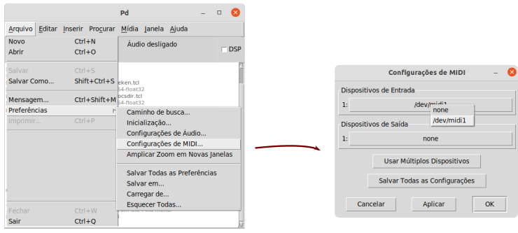
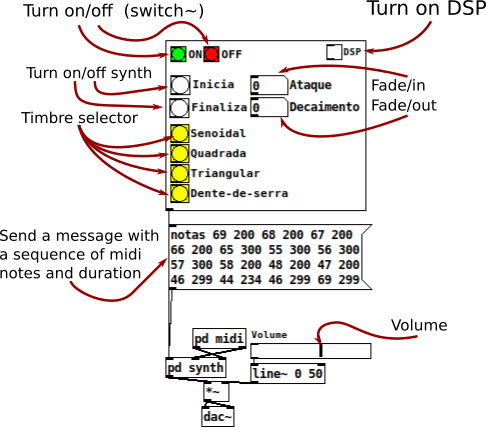

# Multi-Timbre Synthesizer

This synthesizer was built as Program Exercise (EP) of the discipline Musical Computing, from the Institute of Mathematics and Statistics of the University of São Paulo / BR, taught by professor Dr. Marcelo Queiroz.

### How do I download Pure Data?

Miller S. Puckette's "vanilla" distribution of Pd
Último Lançamento: Pure Data 0.51-3
Released 20/11/2020
Link: https://puredata.info/downloads/pure-data

- Required extensions: Zexy (https://puredata.info/downloads/zexy)

### How do I controll the synthesizer?

If you have a synth keyboard, plug it into you computer and

If you don't have a keyboard: https://forum.pdpatchrepo.info/topic/7957/how-to-use-virtual-midi-keyboard-with-pure-data-vmpk

## How the Synthesizer works?

Contact: lealdecastro at gmail.com

